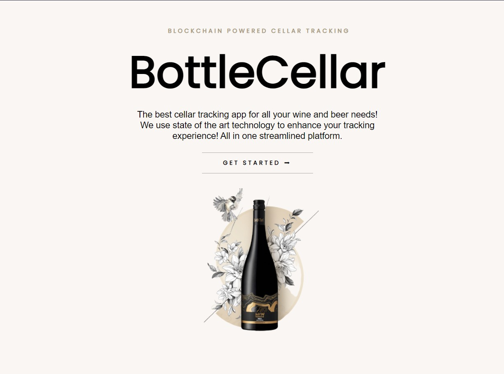
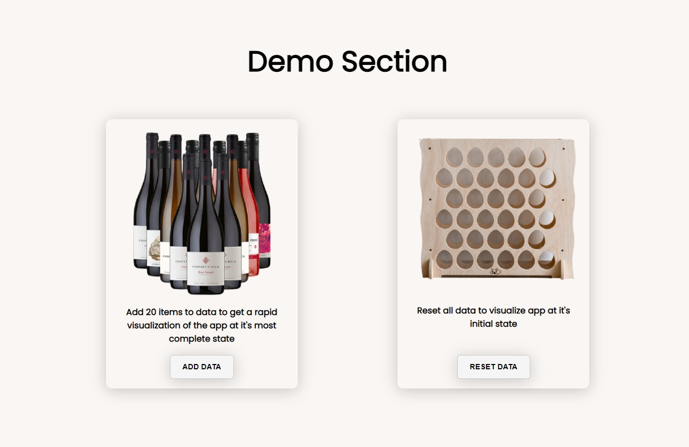

# BottleCellar.io



## Table of Contents
1. [Requirements](#requirements)
1. [Installation](#installation)
1. [Development](#development)
1. [Project Structure](#project-structure)
1. [Quickstart app with mock data](#mock-data)
1. [How to use the app](#use-app)
1. [Developer Experience](#developer-experience)

## Requirements
* Node

## Installation

After confirming that your environment meets the above [requirements](#requirements), you can create a new project based on `BottleCellar` by doing the following:

```bash
$ git clone https://github.com/MrValraven/cellar-tiagocosta.git <my-project-name>
$ cd <my-project-name>
```

When that's done, install the project dependencies.

```bash
$ npm install
```

## Development

After completing the [installation](#installation) step, you're ready to start developing!

**Runing the project in `development` mode:**

```bash
$ npm run dev
```

Hot reloading is enabled by default for both **JavaScript** and **SCSS** files.

**All scripts at your disposal:**

|`npm run <script>`    |Description|
|----------------------|-----------|
|`dev`            	   |Serves your app at [localhost:3000](http://localhost:3000)|
|`build`               |Builds the application to ./dist folder|
|`preview`             |Locally preview production build at [localhost:3000](http://localhost:3000)|

## Project Structure

```
.
├── dist                                          # All build-related source code
│
└── src                                           # Application source code
    ├── assets                                    # asset files to be required
    ├── index.js                                  # Application bootstrap and rendering
    │
    ├── components                                # Global reusable components
    │   └── component-name
    │       ├── component-name.styles.scss        # Your component styles 
    │       ├── component-name.component.jsx      # Pure component source code
    │
    ├── pages                                     # Components that represent each available routes
    │   └── component-name
    │       ├── component-name.styles.scss        # Your component styles
    │       ├── component-name.component.jsx      # Pure Component source code
    │
    ├── static                   
    │      └── mockData.js                         # Constant with mock data for Redux
    │
    ├── redux
    │   ├── cellar
    │   │     ├─cellar.actions.js                  # Reducer actions
    │   │     ├─cellar.reducer.js                  # Reducer source code
    │   │     ├─cellar.types.js                    # Constants of available action types
    │   │     └─cellar.utils.js                    # Utility functions for said reducer
    │   │
    │   ├── root-reducer.js                        # Combine all reducers in one place
    │   └── store.js                               # Redux store bootstrap
    │
 ___├
 │
 │
 │──── App.jsx                                     # Component responsible for getting initial state from localStorage (or set a new one if empty), routes and global components
 │──── App.scss                                    # Global app styles
```

## Quickstart app with mock data

At the end of the landing page, you are presented two buttons that help populate global state as an array of 20 objects or reset it, as an empty array



## How to use the app 

This web app provides a clean and intuitive UI and smooth UX. At the user level you can traverse the app fairly easily and acess all features with ease.
The user can filter the items by:
- Name
- Brand
- Year
- Rating

The user can sort the items by:
- Name (A-Z)
- Name (Z-A)
- Brand (A-Z)
- Brand (Z-A)
- Year (Ascending)
- Year (Descending)
- Rating (Ascending)
- Rating (Descending)
- Quantity (Ascending)
- Quantity (Descending)

In the detailed item page the user can edit the item and it's notes and delete it or remove one of it's notes.

## Developer Experience

This app is developed with scalability in mind.
Each reducer should have it's own folder as to enforce separation of concerns and provide more readable and maintanable project structure.
Each reducer should then be imported to the root-reducer as to connect to the rest of the application.

